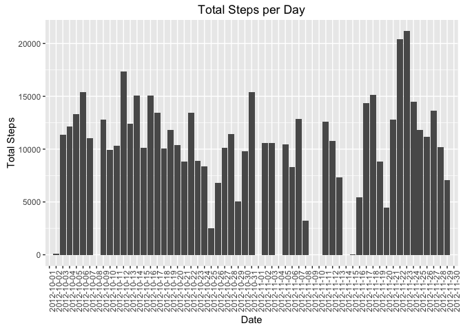
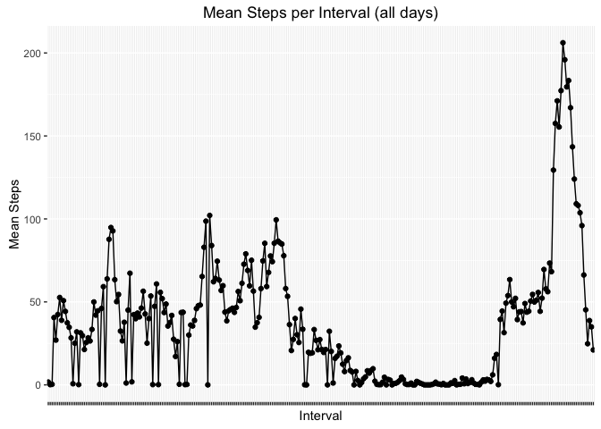
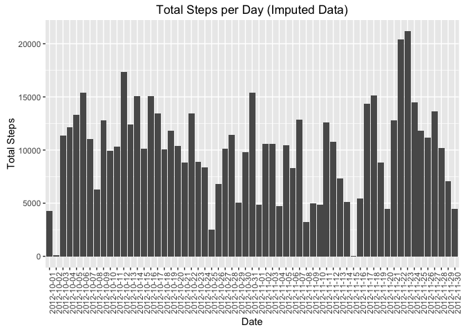
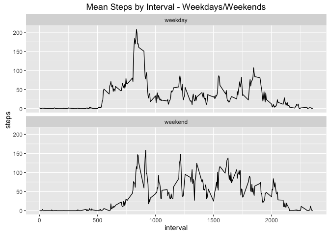

# Reproducible Research Project 1 - PA1_template
Parker Finn  
April 23, 2016  

**Loading Packages**


```r
#Set working directory and load packages

library(ggplot2)
library(magrittr)
library(dplyr)
library(impute)

knitr::opts_chunk$set(echo = TRUE)
```


**Loading and preprocessing the data**

The following code will download, unzip and read the csv file, saving it as the data frame "activity".


```r
URL <- "https://d396qusza40orc.cloudfront.net/repdata%2Fdata%2Factivity.zip"
download.file(URL, destfile = "activity.zip")
unzip("activity.zip")

activity <- read.csv("activity.csv")
```

**What is mean total number of steps taken per day?**


```r
#Total number of steps taken per day
steps <- with(activity, tapply(steps, date, sum, na.rm=T)) %>% as.data.frame()
```

**Histogram of the total number of steps taken each day**


```r
ggplot(steps, aes(dimnames(steps)[[1]], steps)) + geom_bar(stat = "identity") + labs(title = "Total Steps per Day", x = "Date", y = "Total Steps" ) + theme(axis.text.x = element_text(angle = 90)) + scale_y_continuous()
```



**Mean and median number of steps taken each day**


```r
stepsMean <- mean(steps$., na.rm=T)
stepsMed <- median(steps$., na.rm=T)

#Mean steps taken each day
stepsMean
```

```
## [1] 9354.23
```

```r
#Median steps taken each day
stepsMed
```

```
## [1] 10395
```


**Time series plot of the average number of steps taken by interval across all days**


```r
#Calculate mean steps by interval
stepsMeanInterval <- with(activity, tapply(steps, interval, mean, na.rm=T)) %>% as.data.frame()

#Plot histogram
ggplot(data = stepsMeanInterval, aes(dimnames(stepsMeanInterval)[[1]], stepsMeanInterval, group=1)) + geom_point() + geom_line() + labs(x = "Interval", y = "Mean Steps", title = "Mean Steps per Interval (all days)") + scale_y_continuous() + theme(axis.text.x = element_blank())
```



**The 5-minute interval that, on average, contains the maximum number of steps:**


```r
which.max(as.vector(stepsMeanInterval[[1]]))
```

```
## [1] 104
```

```r
stepsMeanInterval[104,]
```

```
##      835 
## 206.1698
```


**The total number of missing values:**

```r
sum(is.na(activity$steps))
```

```
## [1] 2304
```


**Strategy for imputing missing data:**

To impute the missing date, I used the impute.knn function available from Bioconductor.
The activity data was first saved as a new object called "activityImpute". To use the impute.knn function, the object needs to be a matrix. The fields were all changed to Integer values and the data frame object was transformed to a matrix. With this completed, the impute.knn function was run.

The results were then transformed back to a data frame and the date field was reset to the original dates. The new object with imputed data is called "activityImpute".


```r
#Create new object called activityImpute
activityImpute <- activity

#Change all values to integer to allow for transformation to matrix
activityImpute$date <- as.integer(activityImpute$date)

#Save activityImpute object with imputed values, saving result as a data frame
activityImpute <- impute.knn(as.matrix((activityImpute)))$data %>% as.data.frame()

# Reset date to original date
activityImpute$date <- activity$date
```

**Histogram of the total number of steps taken each day after missing values are imputed:**


```r
#Calculate total steps per day
stepsImpute <- with(activityImpute, tapply(steps, date, sum)) %>% as.data.frame()

#Plot histogram
ggplot(stepsImpute, aes(dimnames(stepsImpute)[[1]], stepsImpute)) + geom_bar(stat = "identity") + labs(x = "Date", y = "Total Steps", title = "Total Steps per Day (Imputed Data)") + scale_y_continuous() + theme(axis.text.x = element_text(angle = 90))
```



**Mean and median of number of steps per day with new data set**


```r
imputeMean <- mean(stepsImpute$.)
imputeMed <- median(stepsImpute$.)

#Mean steps
imputeMean
```

```
## [1] 10002.74
```

```r
#Median steps
imputeMed
```

```
## [1] 10395
```

The imputed mean value is 7% higher than the mean with missing values. The median value has remained the same. 


**Differences in activity patterns between weekdays and weekends:**

Create factor variable with levels "weekday" and "weekend".


```r
#Make date field a date variable
activityImpute$date <- as.Date(activityImpute$date)

#Use dplyr to add new field indicating the day of week
activityImpute <- mutate(activityImpute, day = weekdays(activityImpute$date))
                         
#SNew field is character, et day as a factor
activityImpute$day <- as.factor(activityImpute$day)

#Set day levels as "weekend" and "weekday"
levels(activityImpute$day)[c(3,4)] <- "weekend"
levels(activityImpute$day)[c(1,2,4,5,6)] <- "weekday"
```

**Panel plot comparing the average number of steps taken per 5-minute interval across weekdays and weekends:**


```r
#Calculate mean steps for weekdays and weekends
stepsWeekday <- with(activityImpute, tapply(steps, interval, mean)) %>% as.data.frame()

ggplot(activityImpute, aes(interval, steps)) + stat_summary(fun.y="mean", geom = "line") + facet_wrap(~day, nrow=2) + labs(title = "Mean Steps by Interval - Weekdays/Weekends")
```



The weekday data has a pronounced spike in the morning hours. This is likely the time of day that people are starting the day and heading to work. The weekend data has a set of peaks more evenly distributed throughout the daytime, which may indicate people using free time on the weekend for activities throughout the day.


